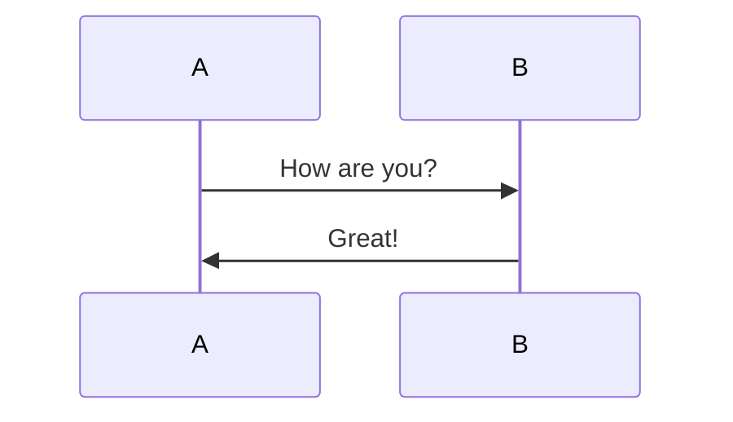
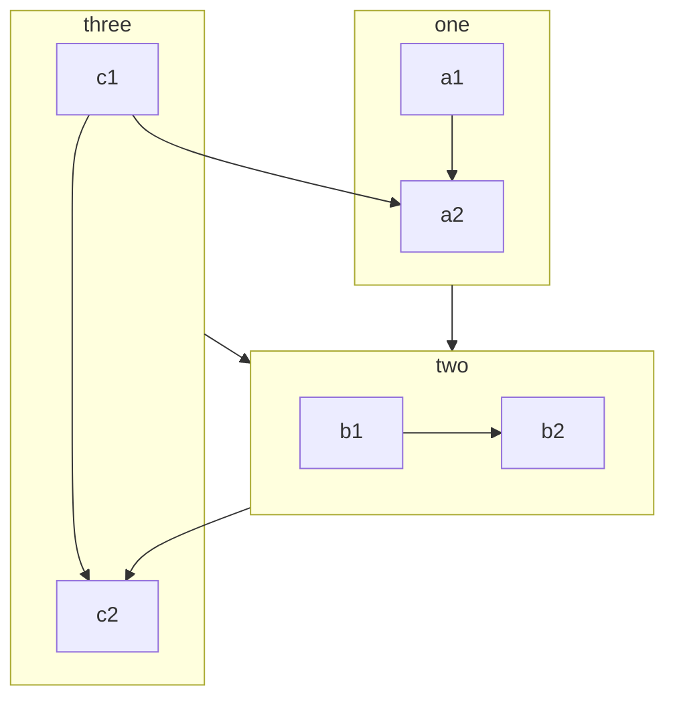

# 
[上海安诺简介](https://www.amino-chem.cn/)

-------------------------------------------------------

[toc]

> forwin
just
for 

上海安诺芳胺化学品有限公司（下文简称安诺化学）隶属于浙江龙盛集团，由浙江安诺芳胺化学品有限公司、浙江鸿盛化工有限公司、安诺化学（香港）有限公司、成都北方化学工业有限责任公司、Intertie GmbH，以及Amino-chem (US) LLC七家公司组成。

安诺化学主要从事胺、酚产业链相关中间体、新材料等产品的研发、生产及销售，其生产基地位于浙江上虞，在中国、美国、德国等多个国家设有办事机构。借助国家级工业园区以及龙盛集团公司的产业链优势，安诺化学现已跃入国际化学品生产商行列。安诺品牌以及国际化操作流程与先进的生产工艺水平，打造了高标准、高质量的产品标杆，成为众多国际知名企业的重要供应商和合作伙伴。

`just for forwin`

| header 1    | header 2    | row 2 col 1 | row 2 col 2 |
| ----------- | ----------- | ----------- | ----------- |
| row 1 col 1 | row 1 col 2 |
| row 2 col 1 | row 2 col 2 |
| row 2 col 1 | row 2 col 2 |

Here's a sentence with a footnote. [^1]

[GVP](https://gitee.com/gvp "test") [^2]
<svg xmlns="http://www.w3.org/2000/svg" width="44.727ex" height="4.855ex" viewBox="0 -1460 19769.5 2146" xmlns:xlink="http://www.w3.org/1999/xlink" aria-hidden="true" style=""><defs><path id="MJX-4-TEX-N-53" d="M55 507Q55 590 112 647T243 704H257Q342 704 405 641L426 672Q431 679 436 687T446 700L449 704Q450 704 453 704T459 705H463Q466 705 472 699V462L466 456H448Q437 456 435 459T430 479Q413 605 329 646Q292 662 254 662Q201 662 168 626T135 542Q135 508 152 480T200 435Q210 431 286 412T370 389Q427 367 463 314T500 191Q500 110 448 45T301 -21Q245 -21 201 -4T140 27L122 41Q118 36 107 21T87 -7T78 -21Q76 -22 68 -22H64Q61 -22 55 -16V101Q55 220 56 222Q58 227 76 227H89Q95 221 95 214Q95 182 105 151T139 90T205 42T305 24Q352 24 386 62T420 155Q420 198 398 233T340 281Q284 295 266 300Q261 301 239 306T206 314T174 325T141 343T112 367T85 402Q55 451 55 507Z"></path><path id="MJX-4-TEX-N-4F" d="M56 340Q56 423 86 494T164 610T270 680T388 705Q521 705 621 601T722 341Q722 260 693 191T617 75T510 4T388 -22T267 3T160 74T85 189T56 340ZM467 647Q426 665 388 665Q360 665 331 654T269 620T213 549T179 439Q174 411 174 354Q174 144 277 61Q327 20 385 20H389H391Q474 20 537 99Q603 188 603 354Q603 411 598 439Q577 592 467 647Z"></path><path id="MJX-4-TEX-N-34" d="M462 0Q444 3 333 3Q217 3 199 0H190V46H221Q241 46 248 46T265 48T279 53T286 61Q287 63 287 115V165H28V211L179 442Q332 674 334 675Q336 677 355 677H373L379 671V211H471V165H379V114Q379 73 379 66T385 54Q393 47 442 46H471V0H462ZM293 211V545L74 212L183 211H293Z"></path><path id="MJX-4-TEX-N-32" d="M109 429Q82 429 66 447T50 491Q50 562 103 614T235 666Q326 666 387 610T449 465Q449 422 429 383T381 315T301 241Q265 210 201 149L142 93L218 92Q375 92 385 97Q392 99 409 186V189H449V186Q448 183 436 95T421 3V0H50V19V31Q50 38 56 46T86 81Q115 113 136 137Q145 147 170 174T204 211T233 244T261 278T284 308T305 340T320 369T333 401T340 431T343 464Q343 527 309 573T212 619Q179 619 154 602T119 569T109 550Q109 549 114 549Q132 549 151 535T170 489Q170 464 154 447T109 429Z"></path><path id="MJX-4-TEX-N-2212" d="M84 237T84 250T98 270H679Q694 262 694 250T679 230H98Q84 237 84 250Z"></path><path id="MJX-4-TEX-N-2B" d="M56 237T56 250T70 270H369V420L370 570Q380 583 389 583Q402 583 409 568V270H707Q722 262 722 250T707 230H409V-68Q401 -82 391 -82H389H387Q375 -82 369 -68V230H70Q56 237 56 250Z"></path><path id="MJX-4-TEX-N-42" d="M131 622Q124 629 120 631T104 634T61 637H28V683H229H267H346Q423 683 459 678T531 651Q574 627 599 590T624 512Q624 461 583 419T476 360L466 357Q539 348 595 302T651 187Q651 119 600 67T469 3Q456 1 242 0H28V46H61Q103 47 112 49T131 61V622ZM511 513Q511 560 485 594T416 636Q415 636 403 636T371 636T333 637Q266 637 251 636T232 628Q229 624 229 499V374H312L396 375L406 377Q410 378 417 380T442 393T474 417T499 456T511 513ZM537 188Q537 239 509 282T430 336L329 337H229V200V116Q229 57 234 52Q240 47 334 47H383Q425 47 443 53Q486 67 511 104T537 188Z"></path><path id="MJX-4-TEX-N-61" d="M137 305T115 305T78 320T63 359Q63 394 97 421T218 448Q291 448 336 416T396 340Q401 326 401 309T402 194V124Q402 76 407 58T428 40Q443 40 448 56T453 109V145H493V106Q492 66 490 59Q481 29 455 12T400 -6T353 12T329 54V58L327 55Q325 52 322 49T314 40T302 29T287 17T269 6T247 -2T221 -8T190 -11Q130 -11 82 20T34 107Q34 128 41 147T68 188T116 225T194 253T304 268H318V290Q318 324 312 340Q290 411 215 411Q197 411 181 410T156 406T148 403Q170 388 170 359Q170 334 154 320ZM126 106Q126 75 150 51T209 26Q247 26 276 49T315 109Q317 116 318 175Q318 233 317 233Q309 233 296 232T251 223T193 203T147 166T126 106Z"></path><path id="MJX-4-TEX-N-27F6" d="M84 237T84 250T98 270H1444Q1328 357 1301 493Q1301 494 1301 496T1300 499Q1300 511 1317 511H1320Q1329 511 1332 510T1338 506T1341 497T1344 481T1352 456Q1374 389 1425 336T1544 261Q1553 258 1553 250Q1553 244 1548 241T1524 231T1486 212Q1445 186 1415 152T1370 85T1349 35T1341 4Q1339 -6 1336 -8T1320 -11Q1300 -11 1300 0Q1300 7 1305 25Q1337 151 1444 230H98Q84 237 84 250Z"></path><path id="MJX-4-TEX-N-2193" d="M473 86Q483 86 483 67Q483 63 483 61T483 56T481 53T480 50T478 48T474 47T470 46T464 44Q428 35 391 14T316 -55T264 -168Q264 -170 263 -173T262 -180T261 -184Q259 -194 251 -194Q242 -194 238 -176T221 -121T180 -49Q169 -34 155 -21T125 2T95 20T67 33T44 42T27 47L21 49Q17 53 17 67Q17 87 28 87Q33 87 42 84Q158 52 223 -45L230 -55V312Q230 391 230 482T229 591Q229 662 231 676T243 693Q244 694 251 694Q264 692 270 679V-55L277 -45Q307 1 353 33T430 76T473 86Z"></path><path id="MJX-4-TEX-I-1D446" d="M308 24Q367 24 416 76T466 197Q466 260 414 284Q308 311 278 321T236 341Q176 383 176 462Q176 523 208 573T273 648Q302 673 343 688T407 704H418H425Q521 704 564 640Q565 640 577 653T603 682T623 704Q624 704 627 704T632 705Q645 705 645 698T617 577T585 459T569 456Q549 456 549 465Q549 471 550 475Q550 478 551 494T553 520Q553 554 544 579T526 616T501 641Q465 662 419 662Q362 662 313 616T263 510Q263 480 278 458T319 427Q323 425 389 408T456 390Q490 379 522 342T554 242Q554 216 546 186Q541 164 528 137T492 78T426 18T332 -20Q320 -22 298 -22Q199 -22 144 33L134 44L106 13Q83 -14 78 -18T65 -22Q52 -22 52 -14Q52 -11 110 221Q112 227 130 227H143Q149 221 149 216Q149 214 148 207T144 186T142 153Q144 114 160 87T203 47T255 29T308 24Z"></path><path id="MJX-4-TEX-I-1D45B" d="M21 287Q22 293 24 303T36 341T56 388T89 425T135 442Q171 442 195 424T225 390T231 369Q231 367 232 367L243 378Q304 442 382 442Q436 442 469 415T503 336T465 179T427 52Q427 26 444 26Q450 26 453 27Q482 32 505 65T540 145Q542 153 560 153Q580 153 580 145Q580 144 576 130Q568 101 554 73T508 17T439 -10Q392 -10 371 17T350 73Q350 92 386 193T423 345Q423 404 379 404H374Q288 404 229 303L222 291L189 157Q156 26 151 16Q138 -11 108 -11Q95 -11 87 -5T76 7T74 17Q74 30 112 180T152 343Q153 348 153 366Q153 405 129 405Q91 405 66 305Q60 285 60 284Q58 278 41 278H27Q21 284 21 287Z"></path><path id="MJX-4-TEX-N-3D" d="M56 347Q56 360 70 367H707Q722 359 722 347Q722 336 708 328L390 327H72Q56 332 56 347ZM56 153Q56 168 72 173H708Q722 163 722 153Q722 140 707 133H70Q56 140 56 153Z"></path><path id="MJX-4-TEX-N-28" d="M94 250Q94 319 104 381T127 488T164 576T202 643T244 695T277 729T302 750H315H319Q333 750 333 741Q333 738 316 720T275 667T226 581T184 443T167 250T184 58T225 -81T274 -167T316 -220T333 -241Q333 -250 318 -250H315H302L274 -226Q180 -141 137 -14T94 250Z"></path><path id="MJX-4-TEX-I-1D44E" d="M33 157Q33 258 109 349T280 441Q331 441 370 392Q386 422 416 422Q429 422 439 414T449 394Q449 381 412 234T374 68Q374 43 381 35T402 26Q411 27 422 35Q443 55 463 131Q469 151 473 152Q475 153 483 153H487Q506 153 506 144Q506 138 501 117T481 63T449 13Q436 0 417 -8Q409 -10 393 -10Q359 -10 336 5T306 36L300 51Q299 52 296 50Q294 48 292 46Q233 -10 172 -10Q117 -10 75 30T33 157ZM351 328Q351 334 346 350T323 385T277 405Q242 405 210 374T160 293Q131 214 119 129Q119 126 119 118T118 106Q118 61 136 44T179 26Q217 26 254 59T298 110Q300 114 325 217T351 328Z"></path><path id="MJX-4-TEX-N-31" d="M213 578L200 573Q186 568 160 563T102 556H83V602H102Q149 604 189 617T245 641T273 663Q275 666 285 666Q294 666 302 660V361L303 61Q310 54 315 52T339 48T401 46H427V0H416Q395 3 257 3Q121 3 100 0H88V46H114Q136 46 152 46T177 47T193 50T201 52T207 57T213 61V578Z"></path><path id="MJX-4-TEX-N-29" d="M60 749L64 750Q69 750 74 750H86L114 726Q208 641 251 514T294 250Q294 182 284 119T261 12T224 -76T186 -143T145 -194T113 -227T90 -246Q87 -249 86 -250H74Q66 -250 63 -250T58 -247T55 -238Q56 -237 66 -225Q221 -64 221 250T66 725Q56 737 55 738Q55 746 60 749Z"></path></defs><g stroke="currentColor" fill="currentColor" stroke-width="0" transform="matrix(1 0 0 -1 0 0)"><g data-mml-node="math"><g data-mml-node="TeXAtom" data-mjx-texclass="ORD"><g data-mml-node="TeXAtom" data-mjx-texclass="ORD"><g data-mml-node="mi"><use xlink:href="#MJX-4-TEX-N-53"></use></g><g data-mml-node="mi" transform="translate(556, 0)"><use xlink:href="#MJX-4-TEX-N-4F"></use></g></g><g data-mml-node="msub" transform="translate(1334, 0)"><g data-mml-node="TeXAtom" data-mjx-texclass="ORD"><g data-mml-node="TeXAtom" data-mjx-texclass="ORD"><g data-mml-node="mpadded"><g data-mml-node="mphantom"></g></g></g></g><g data-mml-node="TeXAtom" transform="translate(0, -150) scale(0.707)" data-mjx-texclass="ORD"><g data-mml-node="TeXAtom" data-mjx-texclass="ORD"><g data-mml-node="mpadded"><g data-mml-node="mn"><use xlink:href="#MJX-4-TEX-N-34"></use></g></g></g></g></g><g data-mml-node="msup" transform="translate(1737.6, 0)"><g data-mml-node="TeXAtom" data-mjx-texclass="ORD"><g data-mml-node="TeXAtom" data-mjx-texclass="ORD"><g data-mml-node="mpadded"><g data-mml-node="mphantom"></g></g></g></g><g data-mml-node="TeXAtom" transform="translate(51.2, 413) scale(0.707)" data-mjx-texclass="ORD"><g data-mml-node="mn"><use xlink:href="#MJX-4-TEX-N-32"></use></g><g data-mml-node="mo" transform="translate(500, 0)"><use xlink:href="#MJX-4-TEX-N-2212"></use></g></g></g><g data-mml-node="TeXAtom" data-mjx-texclass="ORD" transform="translate(2742.4, 0)"></g><g data-mml-node="mo" transform="translate(2964.7, 0)"><use xlink:href="#MJX-4-TEX-N-2B"></use></g><g data-mml-node="TeXAtom" data-mjx-texclass="ORD" transform="translate(3964.9, 0)"></g><g data-mml-node="TeXAtom" data-mjx-texclass="ORD" transform="translate(3964.9, 0)"><g data-mml-node="mi"><use xlink:href="#MJX-4-TEX-N-42"></use></g><g data-mml-node="mi" transform="translate(708, 0)"><use xlink:href="#MJX-4-TEX-N-61"></use></g></g><g data-mml-node="msup" transform="translate(5172.9, 0)"><g data-mml-node="TeXAtom" data-mjx-texclass="ORD"><g data-mml-node="TeXAtom" data-mjx-texclass="ORD"><g data-mml-node="mpadded"><g data-mml-node="mphantom"></g></g></g></g><g data-mml-node="TeXAtom" transform="translate(51.2, 413) scale(0.707)" data-mjx-texclass="ORD"><g data-mml-node="mn"><use xlink:href="#MJX-4-TEX-N-32"></use></g><g data-mml-node="mo" transform="translate(500, 0)"><use xlink:href="#MJX-4-TEX-N-2B"></use></g></g></g><g data-mml-node="TeXAtom" data-mjx-texclass="ORD" transform="translate(6177.8, 0)"></g><g data-mml-node="TeXAtom" data-mjx-texclass="REL" transform="translate(6455.5, 0)"><g data-mml-node="mo"><use xlink:href="#MJX-4-TEX-N-27F6"></use></g></g><g data-mml-node="TeXAtom" data-mjx-texclass="ORD" transform="translate(8371.3, 0)"></g><g data-mml-node="TeXAtom" data-mjx-texclass="ORD" transform="translate(8371.3, 0)"><g data-mml-node="mi"><use xlink:href="#MJX-4-TEX-N-42"></use></g><g data-mml-node="mi" transform="translate(708, 0)"><use xlink:href="#MJX-4-TEX-N-61"></use></g><g data-mml-node="mi" transform="translate(1208, 0)"><use xlink:href="#MJX-4-TEX-N-53"></use></g><g data-mml-node="mi" transform="translate(1764, 0)"><use xlink:href="#MJX-4-TEX-N-4F"></use></g></g><g data-mml-node="msub" transform="translate(10913.3, 0)"><g data-mml-node="TeXAtom" data-mjx-texclass="ORD"><g data-mml-node="TeXAtom" data-mjx-texclass="ORD"><g data-mml-node="mpadded"><g data-mml-node="mphantom"></g></g></g></g><g data-mml-node="TeXAtom" transform="translate(0, -150) scale(0.707)" data-mjx-texclass="ORD"><g data-mml-node="TeXAtom" data-mjx-texclass="ORD"><g data-mml-node="mpadded"><g data-mml-node="mn"><use xlink:href="#MJX-4-TEX-N-34"></use></g></g></g></g></g><g data-mml-node="mo" transform="translate(11594.6, 0)"><use xlink:href="#MJX-4-TEX-N-2193"></use></g><g data-mml-node="TeXAtom" data-mjx-texclass="ORD" transform="translate(12372.4, 0)"></g></g><g data-mml-node="msub" transform="translate(12372.4, 0)"><g data-mml-node="mi"><use xlink:href="#MJX-4-TEX-I-1D446"></use></g><g data-mml-node="TeXAtom" transform="translate(613, -150) scale(0.707)" data-mjx-texclass="ORD"><g data-mml-node="mi"><use xlink:href="#MJX-4-TEX-I-1D45B"></use></g></g></g><g data-mml-node="mo" transform="translate(13737.5, 0)"><use xlink:href="#MJX-4-TEX-N-3D"></use></g><g data-mml-node="mfrac" transform="translate(14793.2, 0)"><g data-mml-node="mrow" transform="translate(220, 710)"><g data-mml-node="mi"><use xlink:href="#MJX-4-TEX-I-1D45B"></use></g><g data-mml-node="mrow" transform="translate(600, 0)"><g data-mml-node="mo"><use xlink:href="#MJX-4-TEX-N-28"></use></g><g data-mml-node="msub" transform="translate(389, 0)"><g data-mml-node="mi"><use xlink:href="#MJX-4-TEX-I-1D44E"></use></g><g data-mml-node="TeXAtom" transform="translate(529, -150) scale(0.707)" data-mjx-texclass="ORD"><g data-mml-node="mn"><use xlink:href="#MJX-4-TEX-N-31"></use></g></g></g><g data-mml-node="mo" transform="translate(1543.8, 0)"><use xlink:href="#MJX-4-TEX-N-2B"></use></g><g data-mml-node="msub" transform="translate(2544, 0)"><g data-mml-node="mi"><use xlink:href="#MJX-4-TEX-I-1D44E"></use></g><g data-mml-node="TeXAtom" transform="translate(529, -150) scale(0.707)" data-mjx-texclass="ORD"><g data-mml-node="mi"><use xlink:href="#MJX-4-TEX-I-1D45B"></use></g></g></g><g data-mml-node="mo" transform="translate(3547.3, 0)"><use xlink:href="#MJX-4-TEX-N-29"></use></g></g></g><g data-mml-node="mn" transform="translate(2238.1, -686)"><use xlink:href="#MJX-4-TEX-N-32"></use></g><rect width="4736.3" height="60" x="120" y="220"></rect></g></g></g></svg>

term
: definition

- [x] Write the press release
- [x] Update the website
- [ ] Contact the media
- 

### 核心技术

公司的主要产品有：间苯二胺、邻苯二胺、对苯二胺、苯胺、间苯二酚、硫酸铵、还原物、间酸、间氨基苯酚以及树脂新材料等。安诺公司的连续硝化工艺是在国内成熟的连续一硝化工艺基础上通过对生产工艺和设备构造合理改进而成。本工艺装备是一个完成反应、传热、传质、提升、分离等过程的有机组合体，装置设有自动化程度很高的DCS集中控制系统，可以对各工艺控制点实施全程监控记录、自动调节、超温报警、联锁停车等，工艺操作灵活、劳动生产率高、DCS集中控制系统的应用不仅降低了工人的劳动强度，同时使生产工艺指标稳定。稳态操作时工艺参数工艺条件变化小，工人操作方便，有利于安全生产，且易于实现自动化控制，产品质量也比较稳定。

安诺化学依托现有生产基础和研发能力，公司和国外知名化工企业开展了以清洁加氢工艺为核心技术，致力于对传统产品生产过程的改造升级，以带动相关产品生产的清洁化，提升国内该类产品的生产水平，提高产品的赢利能力和企业的综合竞争力。
公司已通过“ISO9001：2008”质量管理体系认证、“ISO14001：2004”环境管理体系认证和“GB/T23331-2012”能源管理体系认证。

##### 催化加氢还原
催化加氢还原工艺以二硝基苯和氢气为原料，是一种清洁环保工艺，生产成本较低，该工艺又分为间歇催化加氢、连续催化加氢。
##### 间歇催化加氢还原
国内的催化加氢法大都采用反应釜间歇生产，装置的规模受到限制。

##### 连续催化加氢还原
2003年浙江龙盛集团股份有限公司在在传统催化装置上进行改进，实现混二硝基苯连续催化加氢工艺，然后分离，分别得到间苯二胺、邻苯二胺和对苯二胺的新工艺。该工艺由于邻苯二胺和对苯二胺得到回收，提高了原料的利用率，总收率97%左右，成本比普通催化加氢法进一步降低20%，竞争优势明显。

公司采用连续催化加氢工艺，通过对加氢反应器搅拌装置的结构改造，改善了设备的传热、传质性能，使得气、液、固三相得以充分的接触，降低副反应，提高产品收率；

安诺化学还原物的生产采用自行开发的催化加氢技术，解决传统铁粉还原工艺废铁泥和废水污染的问题，为国内首创。间苯二酚的生产采用间苯二胺水解的新型生产工艺，以间苯二胺为原料通过催化水解一步得到间苯二酚，新工艺技术属国内首创，综合技术指标达到了国际先进水平；新工艺简化了操作流程，设备投资少、生产成本低，产品质量超过了国际同类产品水平、竞争优势突出。

### 数字化经营、高质量发展
作为一家专业化工公司，安诺化学采用了国际先进的装备与工艺，和浙江大学建立了智能制造数字化平台，生产系统通过AMINO-IMD平台进行数字化管控；与美国杜邦达成战略合作伙伴关系，导入杜邦可持续解决方案（DSS）提升公司管理，在保障安全生产的同时，安诺化学更注重于产业链的研究和发展，使安诺各产品之间形成相互支撑及配套，形成强大的市场竞争力。

安诺化学是一个精细化的化工生产企业，对现场仪表精度及控制可靠性方面要求较高，公司主要选用国际知名品牌的电器与仪表，采用最先进的检测与控制装置，仅艾默生、E+H的质量流量计就有近200台，变频器有数百台，同时在生产中使用了很多在线产品分析系统、重要设备在线故障诊断装置，无线智能仪表也在公司得到了运用。
公司非常重视生产过程的安全，在硝化、加氢等危险生产工艺安装了ESD系统，对一些装置实现了一键开停车，同时通过DCS平台实现生产过程在线故障诊断的工作正在实施中。

在资金投入方面，每年在自动化上的投资上千万元，所有装置全部实现了DCS控制，中间体共有18套DCS系统，37个控制站，90个操作站，2300多个控制回路，近7万个控制点。生产信息管理系统（PIMS）在中间体已得到了充分地运用，通过调度系统实现了对全公司的生产实时监控与调度管理。品管分析无纸化；安全、消防、能源计量、环保等数据自动采集，集中实时显示，专业部门对口管理；同时实现了环保装置数据对政府部门的实时传送，目前PIMS系统与Internet已实现对接，可实现在全球任何地方实时监控公司的生产情况。

公司非常重视自动化的发展与完善，首先引进先进的技术与理念，与浙江大学开展校企合作，定期开展技术交流。通过软件定期开展PID参数在线整定，使生产过程不断的得到优化。同时引入浙江大学的先进控制，对生产装置、或生产过程进行优化。充分发挥装置的能效，实现产能最大化、品质最优化、操作最简化、能耗最小化、管理精细化。

安诺化学成立之初就十分注重信息化的建设和投入。2005年就导入了ERP系统，并不断升级满足运营要求。2014年安诺化学引入U9平台，致力建设并满足未来长期业务发展需要的综合性平台。我们还引入了宏景E-HR人力资源系统、金和OA办公自动化系统、企业邮局、门禁一体化系统、微信平台等；视频监控覆盖全厂区、重点危险源。公司在信息化基础架构层，已经构建虚拟化系统保障各业务单元的信息化，在故障时及时切换。

安诺化学专注于信息化的建设，规范公司管理内控流程，提高工作效率，通过引进外部信息咨询服务，制定信息化可持续的发展规划。

### 以人为本
公司现有员工900余人，企业注重文化建设，强调责任与关怀，每年投入大量人力物力营造和提高员工素质的思想文化平台。传播“积极是一种人生态度”的价值观，遵循“简单、高效”的管理原则，提倡企业与员工的互相尊重，坚持可持续发展的模式，特别强调对安全、环保和员工健康的保障。

### 企业荣誉
 - 2004年12月  浙江安诺芳胺化学品有限公司通过ISO9001质量管理体系认证。
 - 2008年4月  浙江安诺芳胺化学品有限公司通过ISO14001环境管理体系认证。
 - 2009年12月 浙江鸿盛化工有限公司通过ISO9001质量管理和OHSAS18001职业健康安全管理体系认证。
 - 2008年 浙江安诺芳胺化学品有限公司荣获全国石油和化工先进集体荣誉。
 - 2008–2009年 浙江安诺芳胺化学品有限公司和浙江鸿盛相继荣获浙江省安全标准化企业。
 - 2011年 浙江安诺芳胺化学品有限公司荣获浙江省标准创新型企业荣誉。
 - 2017年 浙江鸿盛化工有限公司荣获全国石油和化工联合会的“绿色工厂”荣誉称号。
 - 2018年 浙江鸿盛化工有限公司荣获“浙江省高新技术企业资源与环境”十强。
  浙江鸿盛化工有限公司荣获中国工业榜样奖——中国绿色发展优秀企业。
  浙江安诺芳胺化学品有限公司通过工信部两化融合贯标体系认定。
 - 2019年 浙江鸿盛化工有限公司荣获绍兴市首家“浙江制造”品牌企业。
 - 2020年 浙江鸿盛化工有限公司通过工信部两化融合贯标体系认定。
 - 2021年 浙江鸿盛化工有限公司得到绿色化工省级高新技术企业研究开发中心认定。
  浙江鸿盛化工有限公司荣获“浙江省亩均领跑者”荣誉。
 - 2017年12月13日 鸿盛公司荣获“绿色工厂“称号

H~2~O是一种液体
2^10^是1024

[^1]: This is the footnote.
[^2]: the footnote.
